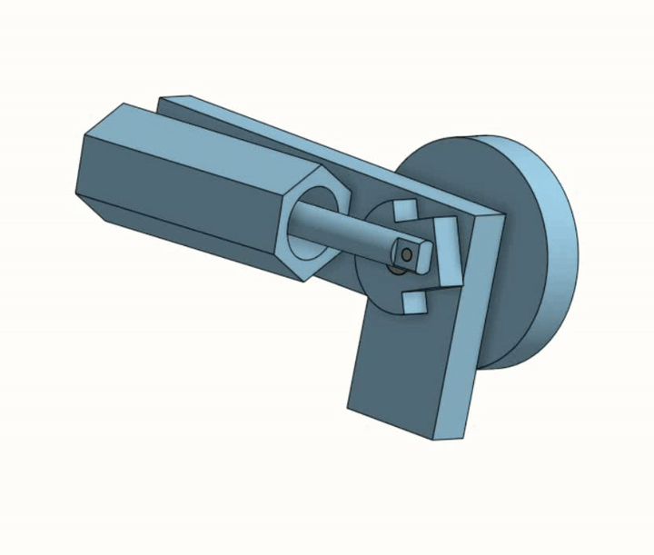

## Design and Prototyping: Crank-Rocker Piston
*Utilized geometric dimension and tolerancing to manufacture a crank-rocker piston.*

## Overview
After studying GD&T, my partner and I took apart the model and measured the necessary dimensions to fully describe each component using calipers. Based on these measurements, we produced formal technical drawings that adhered to standard drafting requirements and included dimensional tolerances for critical features, such as the pressure chamber and press-fitted joints.

In the machine shop, we used the lathe, milling machine, bandsaw, and manual press to fabricate an entirely new part directly from our drawings. This process helped us better understand how formal engineering drafts and tolerance decisions support real design and manufacturing constraints.

## Mechanism

  
   
  <em>Figure 1: CAD animation demonstrating crank-rocker mechanism motion.</em>

## Engineering Drawings
- [Rocker Arm Drawing](docs/Rocker%20Arm%20Drawing.pdf)
- [Wheel Drawing](docs/Wheel%20Drawing.pdf)
- [Crank Shaft Drawing](docs/Crank%20Shaft%20Drawing.pdf)
- [Piston Chamber Drawing](docs/Piston%20Chamber%20Drawing.pdf)
- [Piston Drawing](docs/Piston%20Drawing.pdf)
