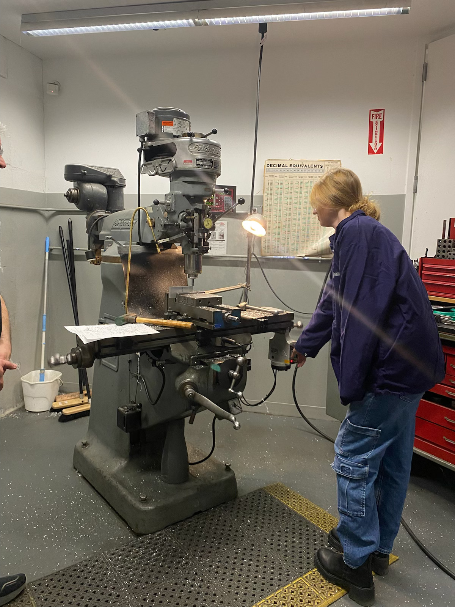
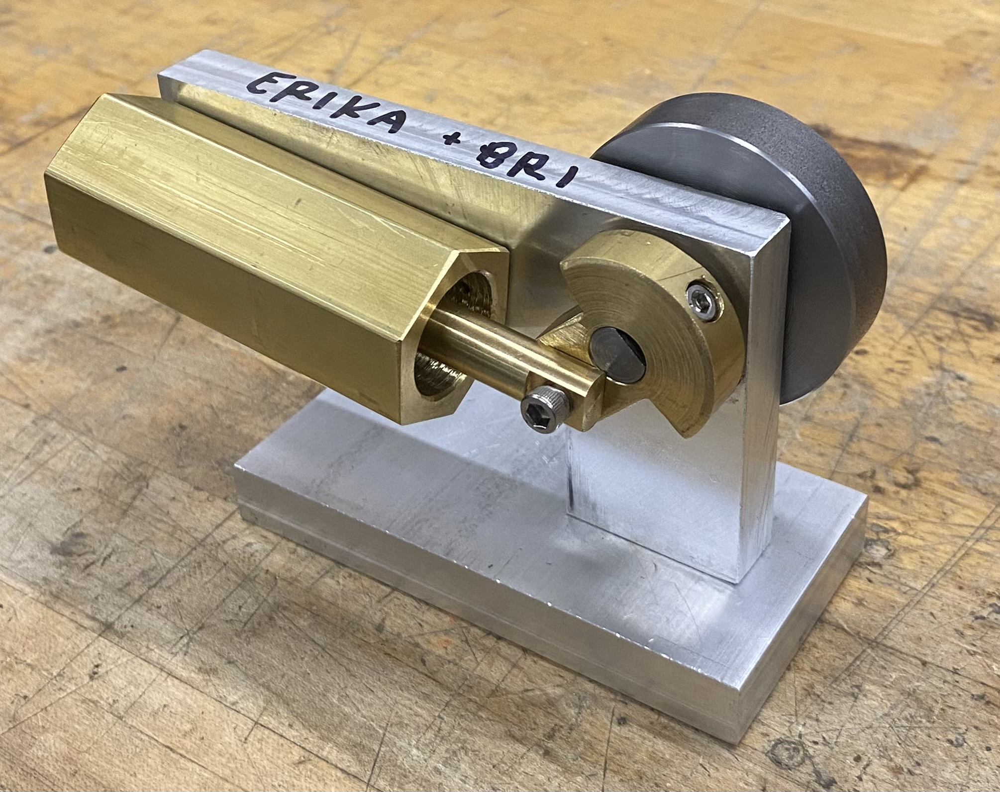

## Design and Prototyping: Crank-Rocker Piston
`GD&T` `Machining` `Onshape`

*Applied geometric dimensioning and tolerancing (GD&T) to reverse-engineer, document, and manufacture a functional crank-rocker piston mechanism.*

### Overview
After studying GD&T, my partner and I took apart the model and measured the necessary dimensions to fully describe each component using calipers. Based on these measurements, we produced formal technical drawings that adhered to standard drafting requirements and included dimensional tolerances for critical features, such as the pressure chamber and press-fitted joints.

In the machine shop, we used the lathe, milling machine, bandsaw, and manual press to fabricate an entirely new part directly from our drawings with assistance from the lab technician. This process demonstrated the relationship between formal engineering drafts and design/manufacturing constraints.

### Mechanism

  
   
  <em>Figure 1: CAD animation demonstrating crank-rocker mechanism motion.</em>

  
   
  <em>Figure 2: Machining a component with the manual milling machine.</em>

  
   
  <em>Figure 3: Final machined aluminum crank-rocker piston prototype. </em>

### Engineering Drawings
- [Rocker Arm](docs/Rocker%20Arm%20Drawing.pdf)
- [Wheel](docs/Wheel%20Drawing.pdf)
- [Crank Shaft](docs/Crank%20Shaft%20Drawing.pdf)
- [Piston Chamber](docs/Piston%20Chamber%20Drawing.pdf)
- [Piston](docs/Piston%20Drawing.pdf)
