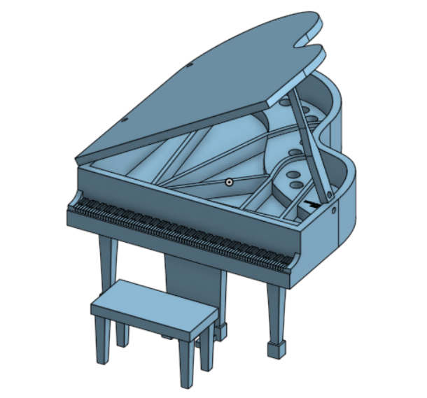
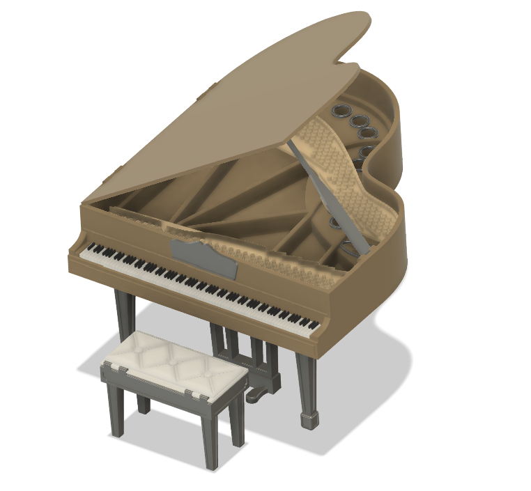
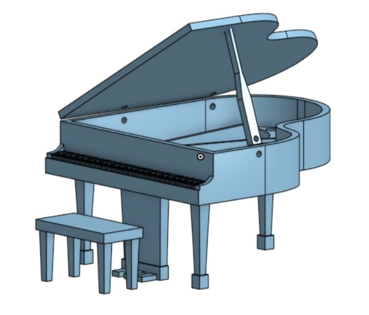
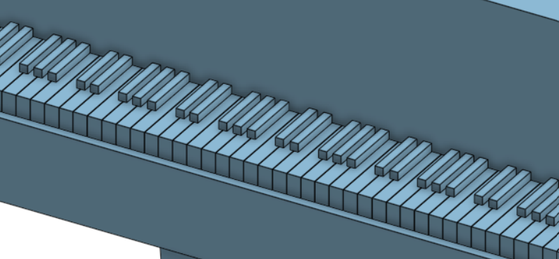
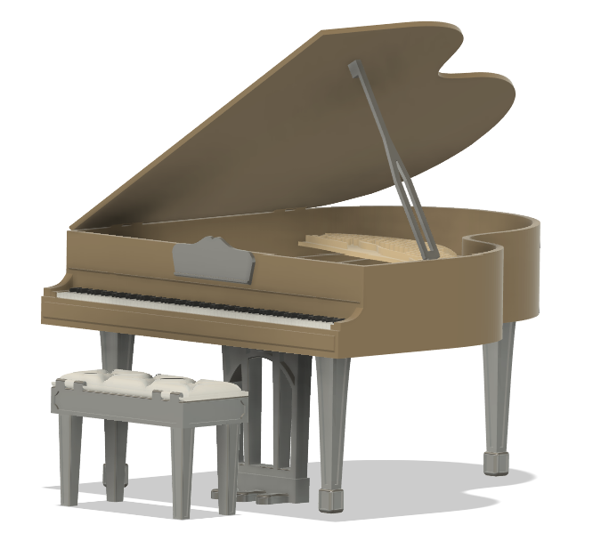
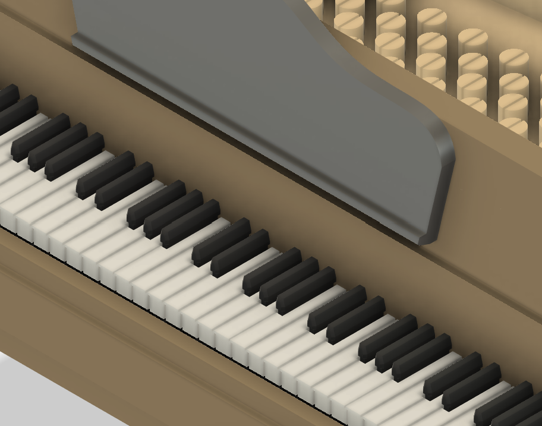
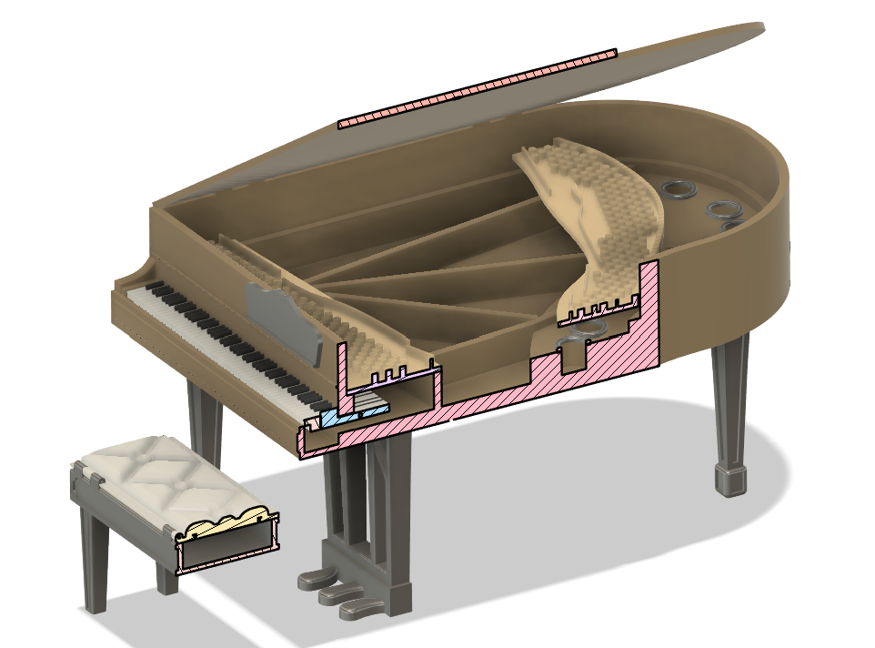
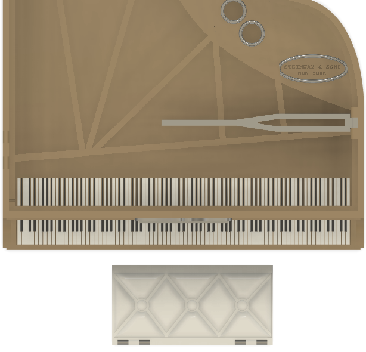
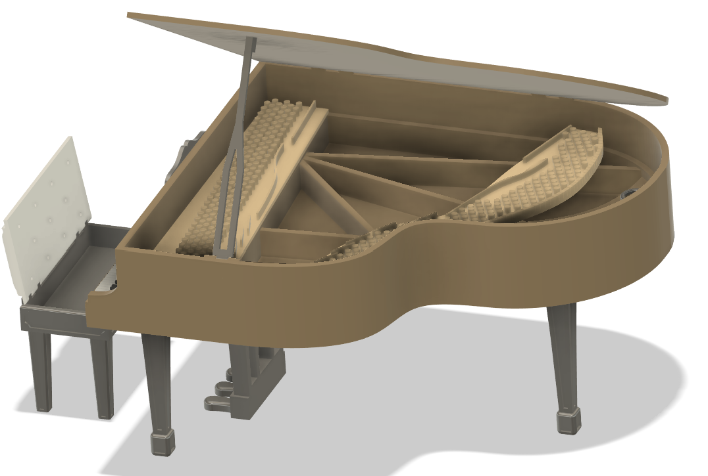

## Personal Design Exploration: Steinway <kbd>Original: Sep 2023</kbd> <kbd>Redesign: Sep 2026</kbd>
`Design` `Fusion360` `Onshape`

*Reverse engineered a miniature scaled model of a Steinway baby grand piano based upon reference photos.Then, mechanically redesigned the static piano model, reconsidering its structure, supports, and actuation.* 

___
## Overview

The initial design was created as a purely aesthetic modeling exercise, then resin printed using a Cooper material grant in the AACE lab, and gifted as a miniature display model. Geometry was simplified to ensure clean printing. 

The mechanical redesign revisits the original model, with particular attention given to developing functionality with independently pressably keys, a hinged lid and stand, and mounting features for fishing-wire strings. The bench was redesigned to include a hinged sheet-music storage compartment. Excess bulk material was reduced and geometry was improved based on experience with PLA behavior.

  
  
   
  <em>Figure 1: Original static and redesigned models.</em>

___
### Static Design

  
   
  <em>Figure 2: Side view of original static model.</em>

  
   
  <em>Figure 3: Detailed view of static model keyboard.</em>

___
### Actuated Mechanism

  
   
  <em>Figure 4: Side view of redesigned model.</em>

  
   
  <em>Figure 5: Detailed view of redesigned model keyboard.</em>

  
   
  <em>Figure 6: Section view of redesigned model keyboard.</em>

  
   
  <em>Figure 7: Top view, emphasizing the levered keys beneath the string boards.</em>

  
   
  <em>Figure 8: Side view, demonstrating the hinged compartments of the body and bench.</em>

___

### Results
The redesigned keyboard uses independently pressable keys with clearances incorporated beneath the black-key geometry to preserve separation between adjacent components. The main body includes a hinged lid and music stand, internal string boards for mounting fishing-wire strings, and reduced bulk throughout the structure. The bench was redesigned with an integrated sheet-music storage compartment and hinged lid. Geometry was further refined based on prior PLA printing experience, with emphasis placed on reducing unnecessary material while maintaining printability and structural support.
