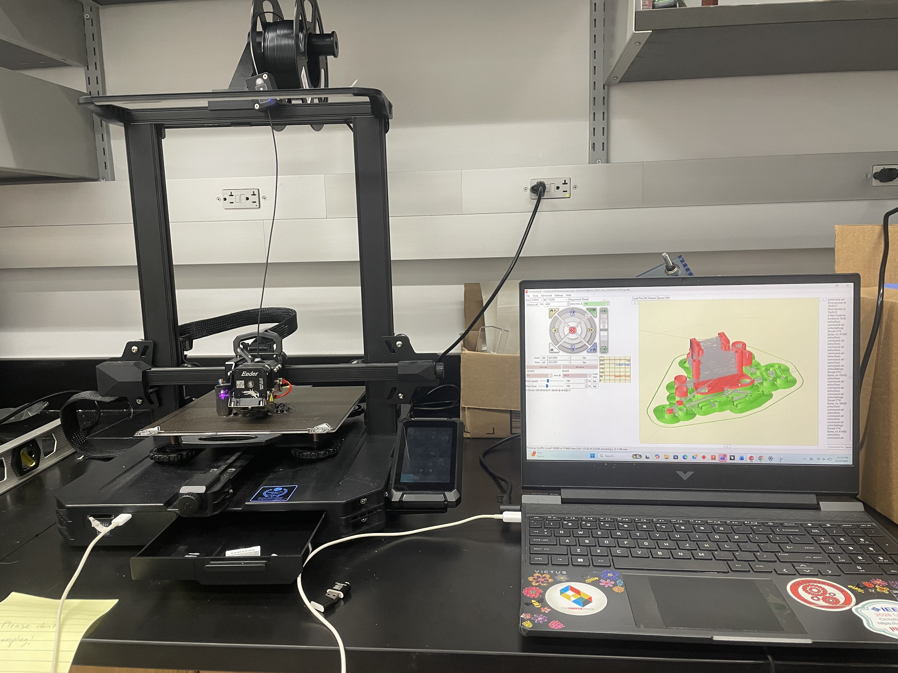
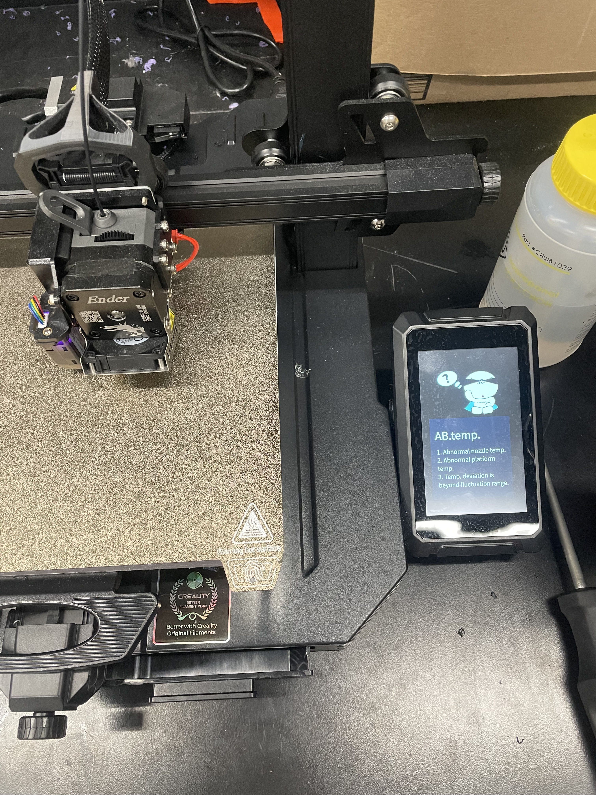
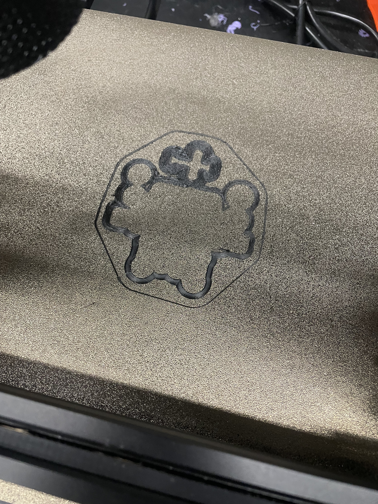
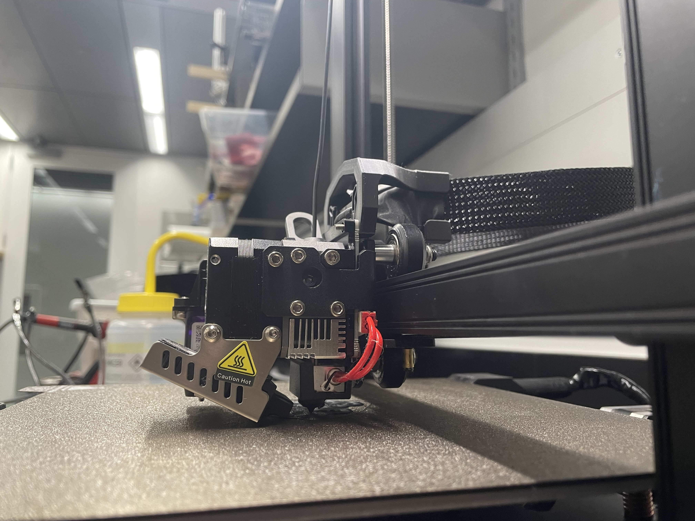
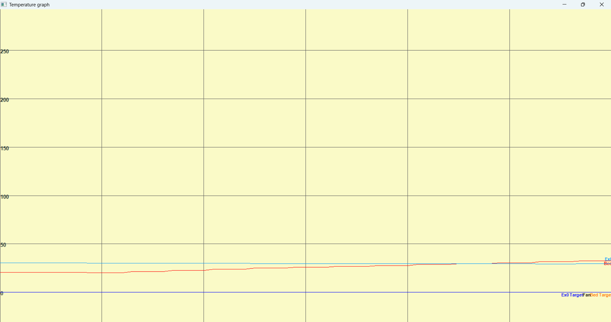
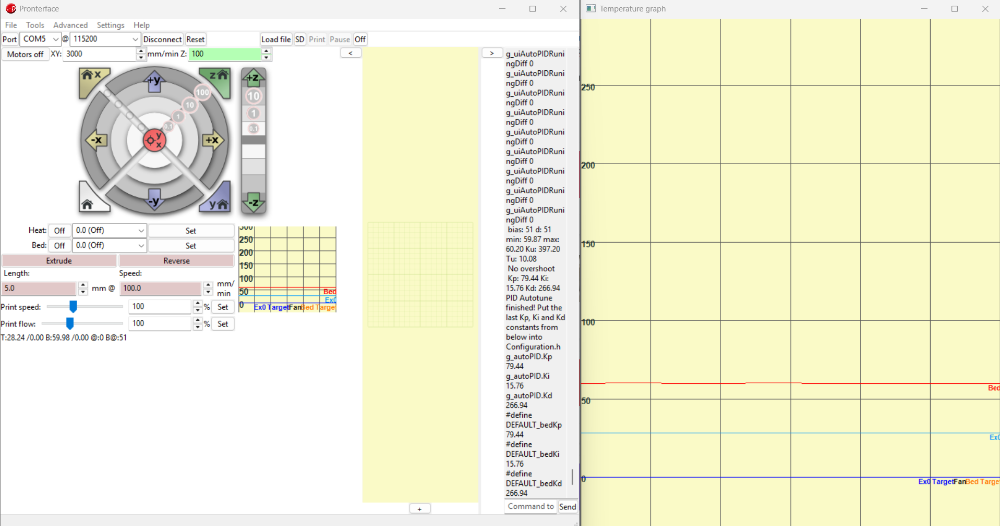
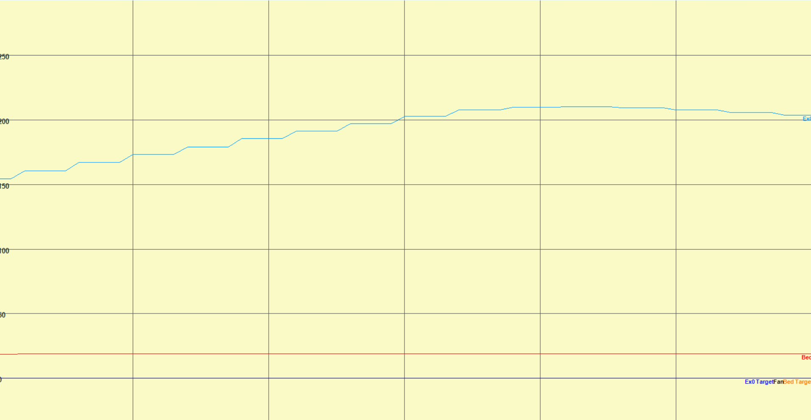
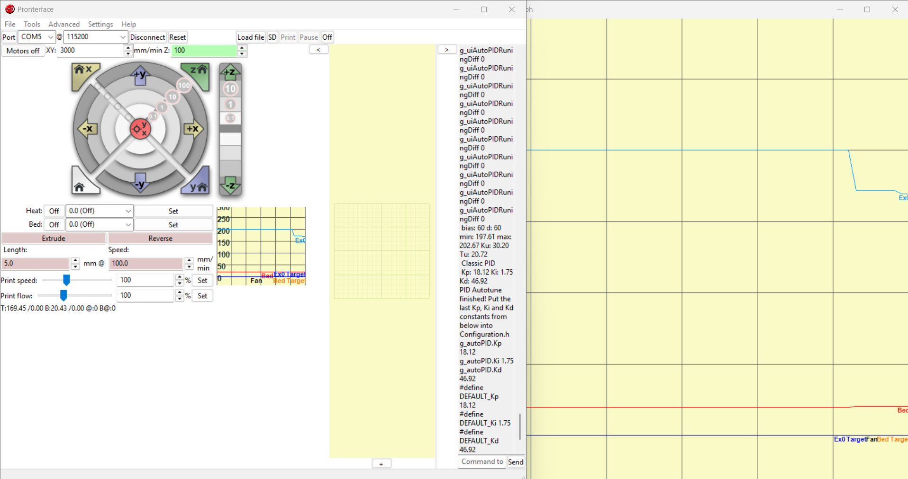

## BIRD Lab: 3D Printer Fault Diagnosis & Calibration

`Hardware Debugging` `PID Tuning` `3D Printing` `Firmware` `Calibration` `Pronterface`

*Diagnosed a heated-bed fault on an Ender 3 S1-Pro. After an assisted repair from a lab technician, recalibrated and tuned the system to restore reliable printing for BIRD Lab prototyping.*

___

## System Overview

The BIRD Lab's Ender 3 S1-Pro became unusable after repeatedly triggering an AB. Temp Error associated with the heated bed and interrupting the print. I determined the source of the temperature fault and after an assisted solder repair, restored its operation.

 
<em>Figure 1: Printer system, following repair and calibration.</em>

The problem was ultimately traced to an electrical fault in the heated-bed assembly power chord rather than a software or calibration issue. After identifying the source of the failure, I requested assistance with the repair and then updated, calibrated, and retuned the printer before returning it to service.

   
  <em>Figure 2: AB.temp error displayed during the initial printer failure.</em>

___

## Fault Diagnosis & Repair
Initially, the stringy and seperated print that occurred repeatedly prior to the failure lead my investigation to retuning the heating gains. Both the motherboard and screen required a firmware update to enable the tuning controls.

   
  <em>Figure 3: Misprinted skirt prior to ABS. Temp. Error.</em>

After connecting my computer to the printer and beginning the tuning cycle, I realized the bed heater was intermitently disconnecting depending on the location of the printer head. Then, I investigated the recurring temperature error by inspecting the heated-bed system and its electrical connections. This isolated the problem to the bed itself, where an electrical connection was shorting and preventing reliable temperature control.

After locating the fault, I worked with Michael Giglia a lab technician to complete a solder repair of the damaged connection. The repair restored normal heated-bed operation and eliminated the electrical fault responsible for the original error.

   
  <em>Figure 4: Ender 3 S1-Pro following repair and restoration.</em>

___

## Firmware & Calibration

Following the hardware repair, I updated both the printer motherboard and display firmware before recalibrating the machine and retuned the printer before returning it to regular use.

The calibration process included bed leveling and thermal control-loop tuning to restore stable temperature regulation. I also calibrated the extrusion system and evaluated the resulting print behavior to improve consistency after the repair.

  
   
   
  <em>Figure 5: Heated-bed temperature response and PID control-loop tuning results.</em>

  
   
   
  <em>Figure 6: Extrusion temperature response and PID control-loop tuning results.</em>

___

## Project Outcome

The repair and recalibration returned the Ender 3 S1-Pro to reliable operation for BIRD Lab prototyping. The project involved diagnosing the root cause of an initially ambiguous temperature fault, completing the necessary hardware and firmware restoration, and validating printer performance through systematic calibration and tuning.

