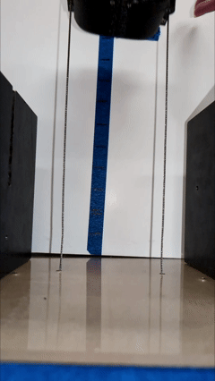
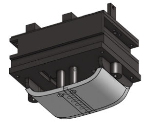
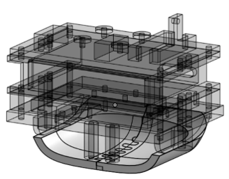
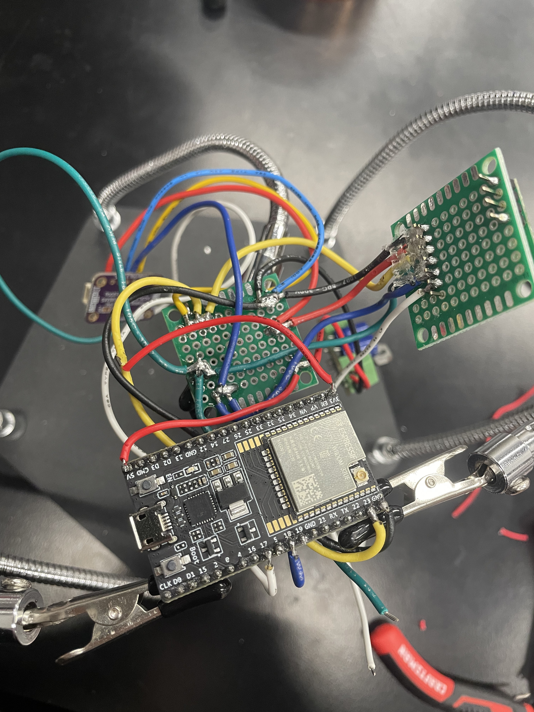
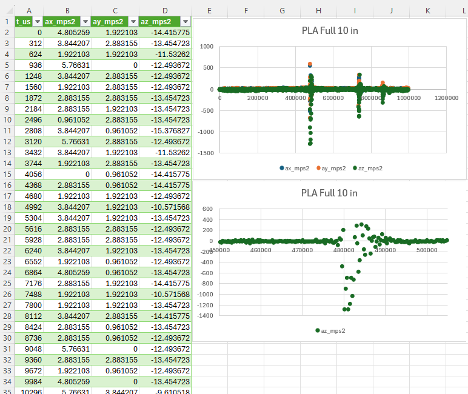

## Bio-Inspired Robotics: Elytra Impact Testing System
`Embedded Systems` `Experimental Design` `Vibration Analysis` `MATLAB` `Excel`

*Designed and instrumented a dynamic drop-testing system to analyze beetle elytra-inspired impact protection for flapping-wing micro air vehicles.*

  <a href="docs/ME_459_Beetle_Elytra_Report.docx">Full Technical Report</a>
  &nbsp; | &nbsp;
  <a href="docs/ME459_Beetle_Elytra.pptx">Project Presentation</a>
  &nbsp; | &nbsp;
  <a href="docs/elytra_esp32_code/">ESP32 Source Code</a>

___

## System Overview

I worked with a partner to investigate whether beetle elytra-inspired protective shells could improve the structural robustness of flapping-wing micro air vehicles (FWMAVs) to build on prior robotic elytra research by Vourtsis et al. 

FWMAV commonly leave motors, linkages, and electronics exposed, making their lightweight structures particularly vulnerable to damage. Our project combined static compression testing with dynamic drop experiments to characterize both structural failure and shock transmission through 3D-printed PLA and TPU shell configurations.

I developed and performed the dynamic portion of drop testing, and designed/fabricated the sled and shells. My partner investigated locking joints and performed Instron testing. 

   
  <em>Figure 1: Final instrumented drop rig used for dynamic impact testing of the elytra-inspired shell designs.</em>

___

## My Contributions

My work focused on developing the dynamic impact-testing system and characterizing the resulting vibration and shock response experienced by the circuitry. I designed the guided drop rig, shell, and electronics sled, developed the embedded data-acquisition system used during dynamic testing, and analyzed the resulting acceleration data. 

### Mechanical Design
The sled was designed as a compact, modular assembly to withstand repeated impacts without brittle fracture. The 3D-printed impact plate, air-gap separator, accelerometer plate, battery holder, and electronics compartment were fastened using eight screws per side, prioritizing robustness and rigid mounting.

The rig was developed to create repeatable vertical impacts while measuring the acceleration transmitted through the protective shell to the internal electronics. The final sled had a mass of 223 g and traveled vertically along stainless-steel guide wires through Delrin bushings to constrain its impact orientation. Interchangeable elytra shells were mounted beneath the electronics assembly, allowing the same instrumented sled to be used across PLA, TPU, and unprotected drop configurations.

   
  <em>Figure 2: CAD of the guided drop sled and elytra shell test assembly.</em>

   
  <em>Figure 3: Interior of drop sled CAD emphasizing the modular 3d print body with delrin guide bushings and screws.</em>

### Embedded System Data Aquisition

The electronics system used an ESP32 and ADXL375 high-g accelerometer to record triaxial acceleration during impact and locally store data via microSD. Separate SPI buses (HSPI and VSPI) for the accelerometer and microSD module were established due to communication interference, and measurements were buffered in RAM during each drop before writing the completed trial to CSV, allowing the system to maintain the maximum 3200 Hz sampling rate.

   
  <em>Figure 4: Soldered ESP32, accelerometer, microSD, and power-distribution electronics (5V from battery stepped down to 3.3V) used for onboard data acquisition.</em>

___

### Dynamic Impact Testing

Due to cost constraints, the sled was manually dropped so the rig was fitted with lights/buttons to coordinate the drop within the recording window. A countdown indicated when to release the sled, followed by separate indicators for active data collection and microSD storage.

Acceleration data was collected at 3200 Hz to capture the short-duration impact response and measurements were buffered during acquisition and written to memory after each trial.

   
  <em>Figure 5: 3200 Hz triaxial acceleration and isolated z-axis primary impact data recorded during a 10 in. PLA-shell drop test.</em>

___

### Vibration & Impact Analysis

The measured acceleration data was used to characterize shock transmission and vibration of the elytra sled. Before testing, a simplified spring-mass-damper impact model was developed using the Lagrange Energy Method to relate drop height, impact velocity, shell stiffness, damping, and stopping distance. The model established an initial 10–20 in. test range while limiting predicted acceleration to the +/- 200 g measurement range of the ADXL375.

Peak acceleration and impact duration were then compared across the bare sled and PLA and TPU shell configurations. To examine the frequency response of the shells the measured acceleration data was processed in MATLAB using Fast Fourier Transforms (FFT). For the solid-shell configurations, dominant frequency peaks occurred near 998 Hz for PLA and 920 Hz for TPU. The half-power bandwidth method estimated damping ratios of 0.0189 and 0.0245, indicating lightly damped responses with slightly greater damping in TPU.
**ADD IN MATLAB AND REFERENCE PICTURE HERE**

___

### Project Outcome

The TPU butt-joint configuration produced the lowest measured peak acceleration, approximately 50% lower than the unprotected drop, demonstrating the benefit of a more compliant shell for reducing transmitted shock.

Future iterations could improve the sled constraints to reduce rotation during impact, reduce sled mass to enable higher drop heights, and investigate composite shell materials and more complex joint geometries.
