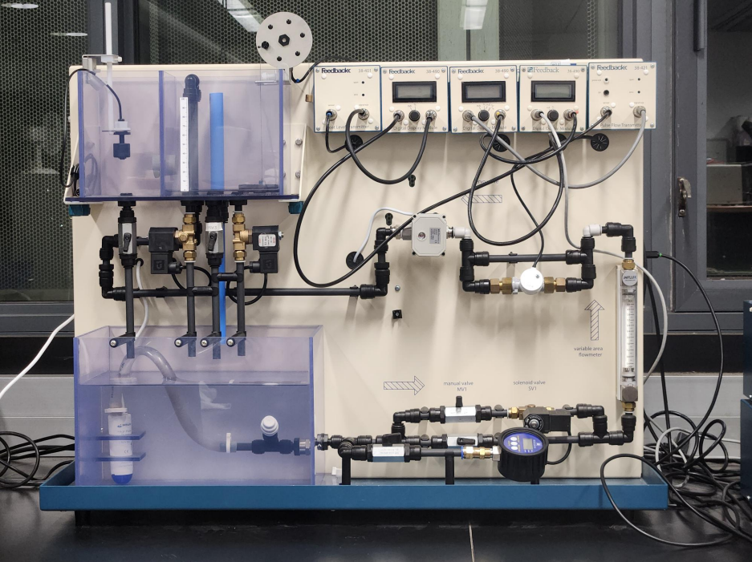
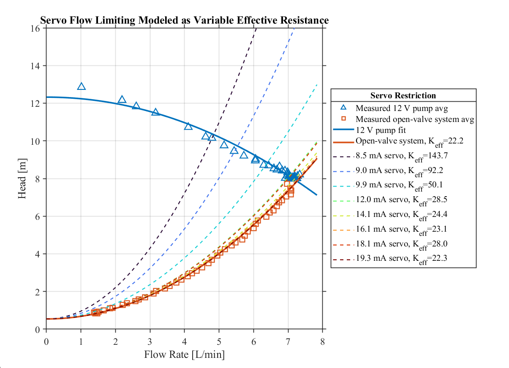
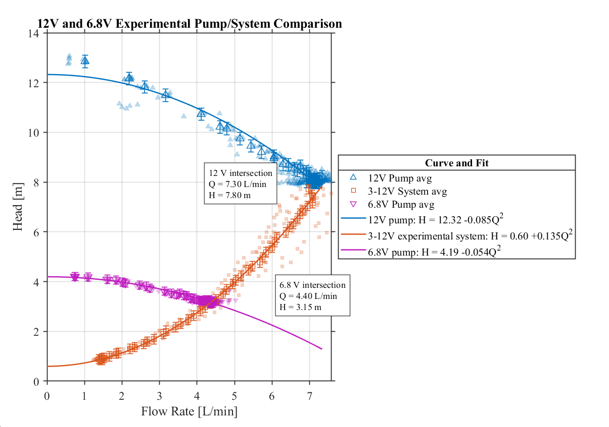

## Engineering Experimentation: Fluid Level Control System
*Experimentally characterized the pump and system head of a level control rig, identified model parameters from the data, and used a theoretical model to evaluate operating points of the system.*

<a href="docs/Final_Report.pdf">Full Technical Report</a>

___

### System Overview

I worked with a team to recharacterize and suggest a solution for the level control rig used for ME 352 Process Control Laboratory. After failure of the original 4.4 L/min centrifugal pump and servo valve, the system was outfitted with a 13 L/min replacement pump and ball-servo valve. These changes to the system increased sensitivity in controlling the restriction and increased the flow rate beyond range of the pulse meter and rotameter. This confined lab groups to the nearly closed ball valve position (to artifically restrict the flow rate into an operable range), and data was incredibly influenced by the sensitivity of the new ball valve and nonlinearity of the response in the low flow region.

   
  <em>Modified Feedback 38-100 flow/level process control rig.</em>

___

### My Contributions

My work focused on processing the experimental data and theoretically modeling the modified flow control rig. I developed a Bernoulli based model relating measured pressure and tank filling data to pump and system head, then modeled major and minor hydraulic losses throughout the system geometry. I compiled the datasets and created experimental plots with fitted curves, quantified random and total measurement uncertainty, mapped the system geometry, and contributed to recalibrating the flow instrumentation. 

   
  <em>Dimensioned fluid-system diagram with points utilized for major and minor losses (stars/letters) and Bernoulli's (circles).</em>

When the geometry based model underpredicted the measured system resistance, I back-calculated an effective unmodeled loss coefficient relating the theoretical to experimental behavior. The resulting theoretical pump and system curves showed that compensating with the ball-servo restriction shifts operation into the valve’s highly nonlinear low flow region, away from the natural operating point the procon rig was designed for.

   
  <em>Measured pump and open-valve system behavior compared with modeled system curves across variable servo-valve restrictions.</em>

This work culminated to the final pump and system head curve and operating-point analysis used to evaluate practical operating limits for the modified rig, suggesting the original 12V supply should be limited to 6.8V to reduce the pump output without increasing wear on the servo and extending the data beyond the nonlinear region.

   
  <em>Final experiental system vs pump curves and the current (12V) and ideal (6.8V) operating points of the pump.</em>

