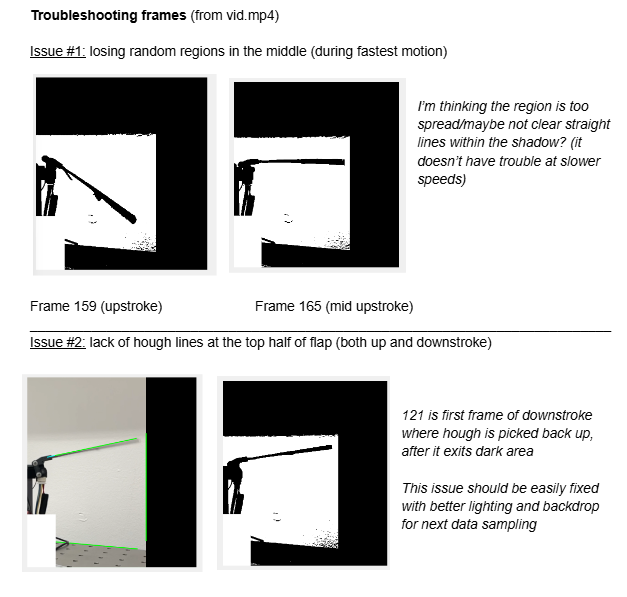
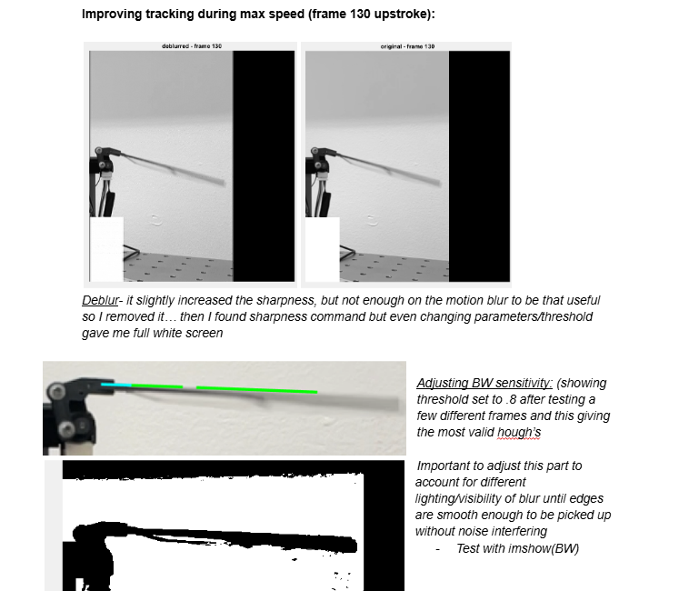
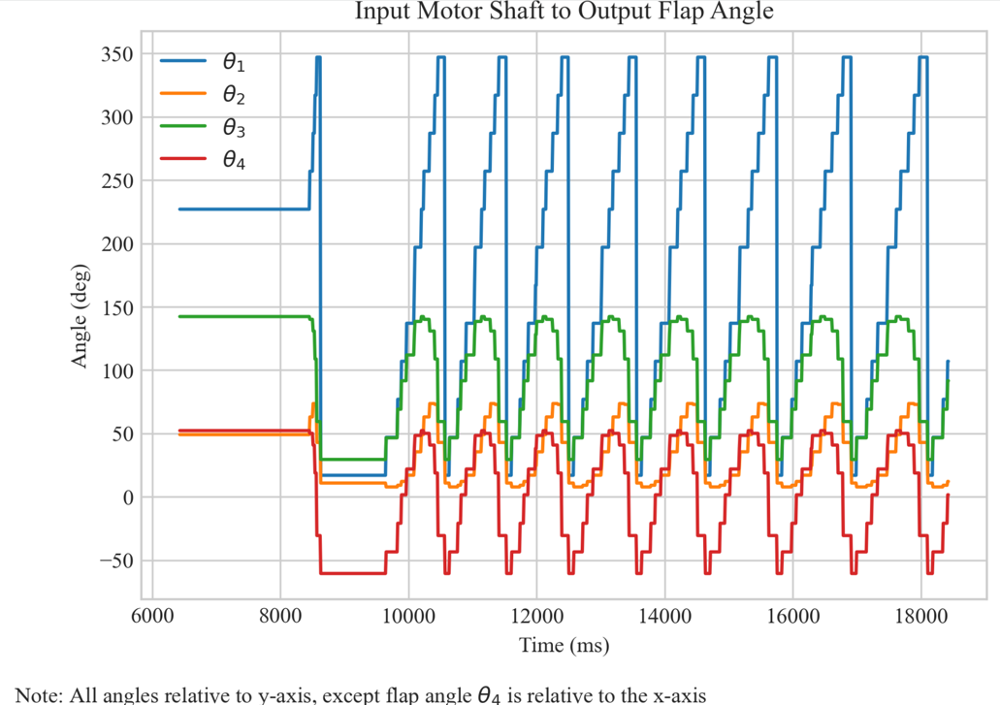
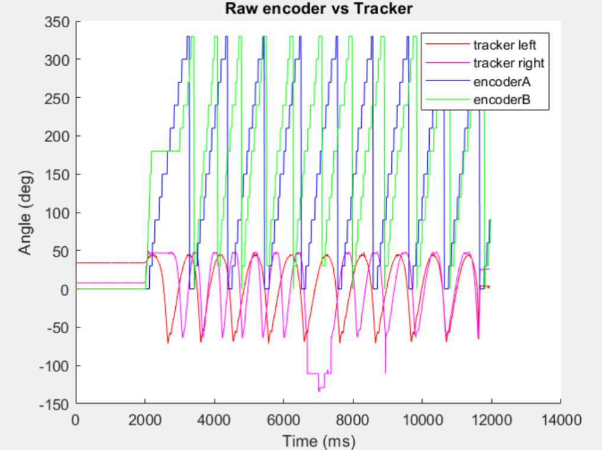

## Research II:   PID Digital Controls
`Embedded Systems` `Prototyping` `Data Analysis` `Digital Controls` `Experimentation` `C++` `MATLAB` `Python`

*Diagnosed the phase lag in a flapping-wing micro air vehicle and redesigned its sensing and control architecture using high-resolution absolute encoders and cascaded position–velocity control.*

  <a href="https://docs.google.com/document/d/1ILJsn2BqDa4JZpfOpJrrtF3mizGmHAdJmF_pN2wB2kI/edit?usp=sharing">Research Documentation</a>
  &nbsp; | &nbsp;
  <a href="docs/BIRD_Controller.cpp">Controller Source Code</a>
  &nbsp; | &nbsp;
  <a href="docs/Linkage_Conversion.ipynb">Linkage Conversion Code</a>

___

### System Overview

The CU-BIRD flapping wing micro air vehicle has two independent hobbyist plastic-geared motors to allow advanced maneuvers without exceeding strict mass constraints. However, the original model exhibited significant phase lag between wings making flight impossible. After reading the master's thesis, I became interested in investigating the 12-point quadrature encoders and relative velocity PID controller. 

  
   
  <em>Figure 1: Research poster presented at 2025 MIT IEEE Conference.</em>

___

### Phase-Lag Diagnosis

To isolate the source of the observed phase lag, I developed a video-based tracker of the physical wing motion to compare against the quadrature encoder signal data. 

The script extracted the linkage orientation from 240 fps test footage, and recorded with a ring light/blank poster to minimize shadows. A minimum squared distance filter was utilized to constrain the location and calibrate to the starting wing position manually from the first frame.

Each frame was cropped and masked to limit irrelevant line interference from the wires and stand. Additional processing included converting to grayscale, and binarizing to isolate the mechanism. Canny edge detection reduced the processed image, preparing the data for a Hough transform to identify straight edged line segments corresponding to the linkage. Through repeated testing, parameters were adjusted to optimize the video data quality.

 

  
  
   
  <em>Figure 2: MATLAB data processing and troubleshooting during development.</em>

 

To minimize false identification especially along the coupler linkage and shadow, geometric constraints were added to distinguish between the wing and surroundings. Canidate lines (green) were required to originate within a defined radius of the manually selected/calibrated region from the base to the tip at the beginning of the experiment. Short segments were rejected, and angle changes between frames greater than 50 degrees were discarded. The remaining canidate line closest to the stable pivot was selected as the tracked final Hough line (blue) and the angle was extracted with respect to horizontal.

Then, the incremental encoders' serial reads were mapped to the flapping output through linkage geometry in Python and compared to the video data as an absolute reference frame. 

 

  
   
  <em>Figure 3: Python linkage conversion. The linkages (crank, coupler, output and fixed frame) are numbered 1-4 respectively.</em>

 

The results emphasized the impact of the low-resolution data introducing the phase lag. Since the original control was a leader-follower system between the wings, with a PID done on relative velocity, regardless of tuning they remained out of sync. Additionally calculations proved that the resolution was much too low to be sufficient for 5 Hz flapping frequency.

 

  
   
  <em>Figure 4: Final combined MATLAB extracted visual data with Python encoder data for both wings.</em>

___

### Controller Redesign

In the original leader–follower architecture, synchronization depended on relative velocity feedback between the two independently driven wings; as a result of the 12 counts per revoluation, insufficient sensing resolution limited the controller's ability to detect and correct phase error. PID retuning alone could not reliably maintain synchronization. Therefore, I restructured the control architecture and designed another circuit using AS5047P absolute encoders with much finer resolution (14-bit or 16,384 counts per revolution). Using a Teensy 4.0 motor controller, I implemented an alternative C++ script.

Since the absolute postion encoder allowed the use of a position PID rather than a velocity PID based on the relative difference between two points. Based on the second order approximation for DC motors and theoretical modeling in MATLAB control designeer, the position loop alone should have allowed the angular position to asymptotically approach the setpoint; however, in experimental testing the position experienced sustained oscillations likely due to unmodeled second order effects. 

To better control the relationship between the voltage supplied and resulting motor position, I created a cascaded loop with an inner velocity loop based on the setpoint of the position PID. This more directly relates ramped or sinosoidal motion to the motor torque, allowing precise control of the position to both a stable and moving setpoint. 

___

### Outcomes

After tuning both layers of the cascaded PID using the continuous cycling method, I developed a 5 Hz cyclic test in order to provide worst case tracking data. Error between the setpoint and actual position remained primarily between 0 and +/- 2 degrees, with a maximum error of 15 degrees near the rapid pivot. The goal was approximately +/- 10 degrees error due to the relatively high frequency, thus the design largely surpassed requirements. 

Current work has focused on iterating the linkages mounting the magnets over the encoder board to finalize the transmission assembly. Future work may include adding a torque loop once additional friction and cyclic flapping are incorperated to the model, to more directly relate the motor torque to the reaction forces the bird will actually experience in flight beyond a static bench test. 
