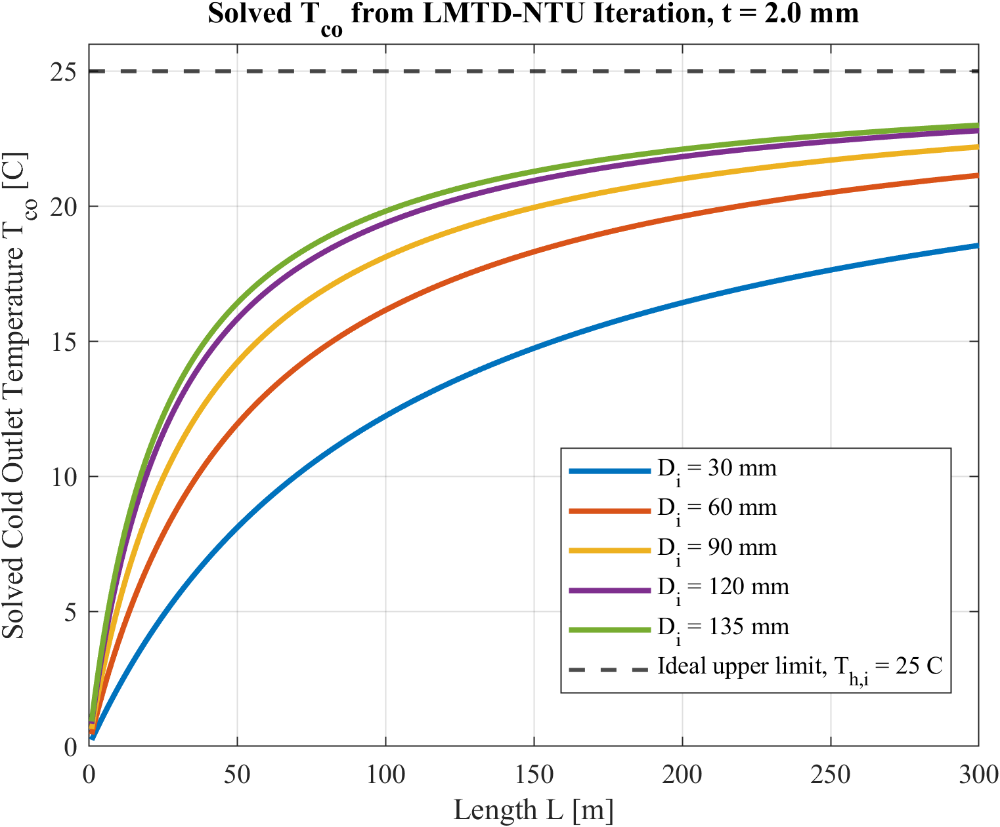
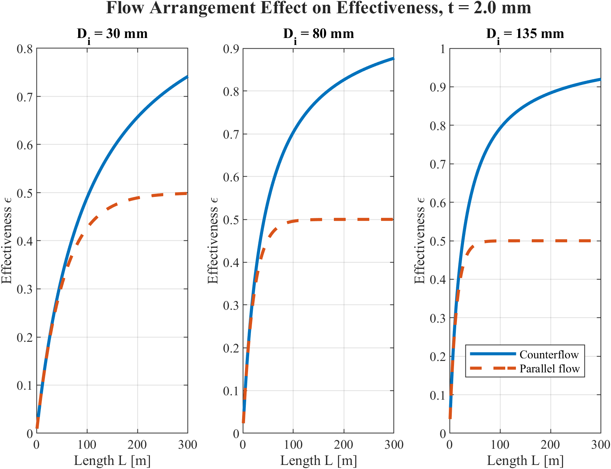
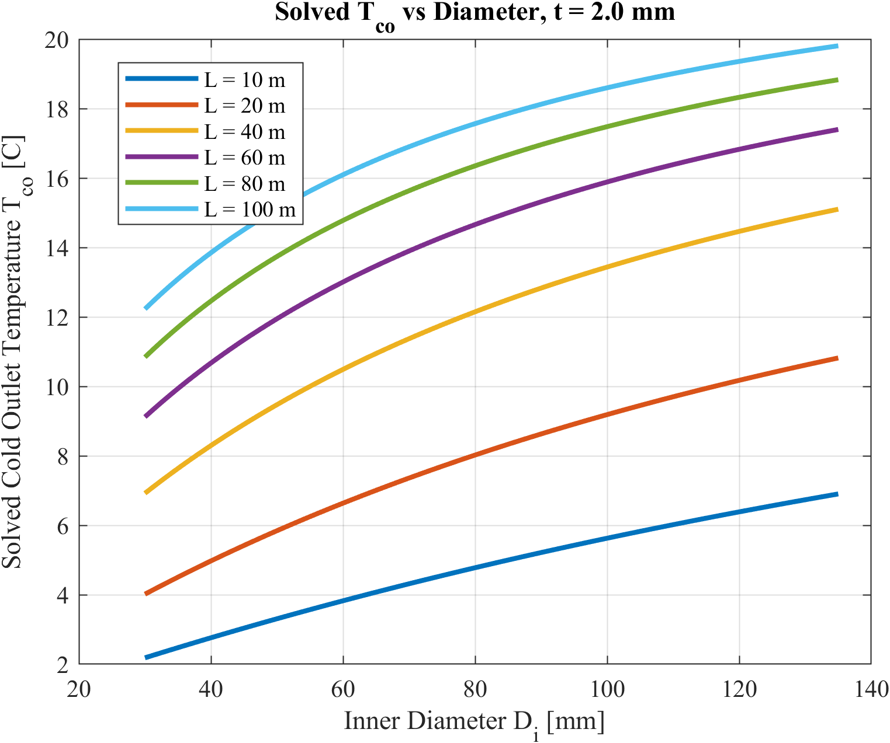
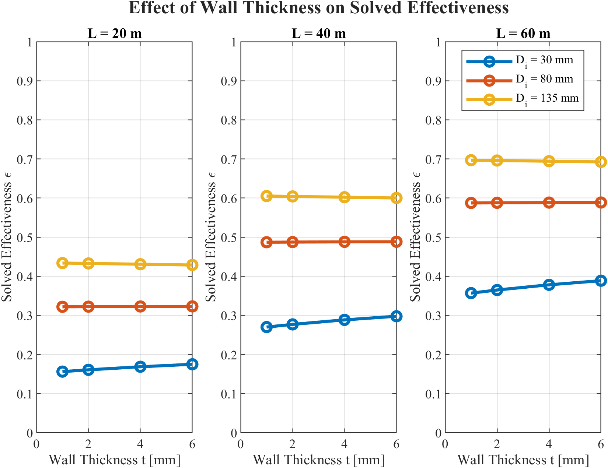
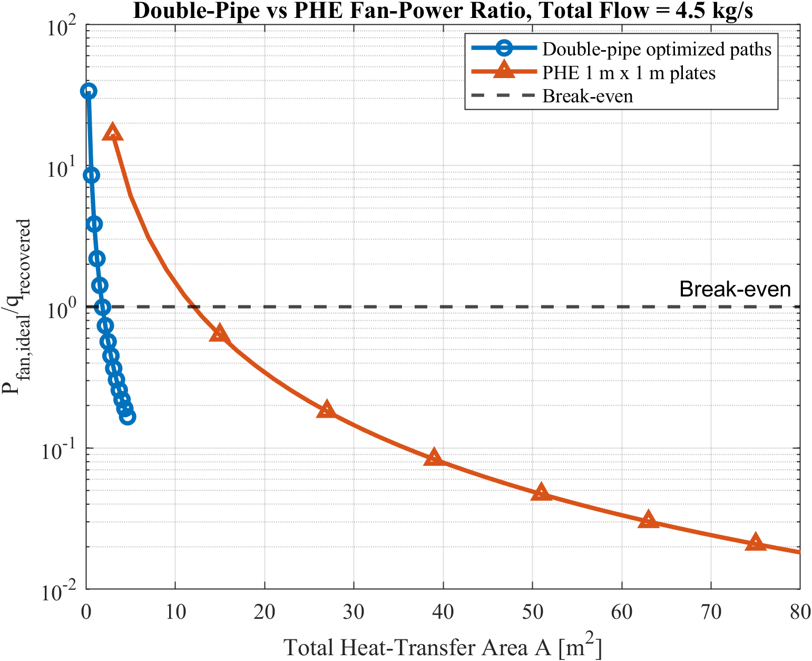

## Heat Transfer: Parameterized LMTD-NTU Heat Exchanger Model

`Heat Transfer` `System Modeling` `Design Optimization` `MATLAB`

*Worked with a team to design and evaluate an air-to-air heat exchanger for HVAC recovery at 41 Cooper Square. I developed a parameterized MATLAB model using the LMTD and effectiveness-NTU methods to solve outlet conditions and characterize heat transfer across potential designs.*

  <a href="docs/lmtd_ntu_incremental_solver.m">MATLAB Source Code</a>

---

## System Overview

This project focused on designing an air-to-air heat exchanger to recover heat between two air streams for 41 Cooper Square. Our team initially explored a plate heat exchanger before moving toward a double-pipe configuration for the final design.

Early calculations used separate LMTD and effectiveness-NTU models to evaluate a single set of design conditions. My work focused on expanding these calculations into a full parameterized MATLAB model that could solve the thermal behavior of the heat exchanger and compare potential geometries.

Rather than fixing the outlet temperatures beforehand, the model solved for the hot and cold outlet temperatures for each geometry while checking the heat-transfer predictions from the LMTD and NTU methods against one another to converge onto possible outputs.

  

<em>
Figure 1: Solved cold-side outlet temperature across heat exchanger lengths and inner pipe diameters.
</em>

---

## Parameterized Heat Exchanger Model

I parameterized the inner pipe diameter, heat exchanger length, and wall thickness to evaluate how changes in geometry affected the performance of the system.

For each geometry, the model calculated the Reynolds numbers and convection coefficients of the hot and cold air streams, wall conduction resistance, overall heat-transfer coefficient, NTU, effectiveness, heat-transfer rate, and outlet temperatures.

The model then used these results to evaluate the design space rather than requiring each potential heat exchanger geometry to be calculated individually.

  

<em>
Figure 2: Counterflow and parallel-flow effectiveness across heat exchanger length and selected pipe diameters.
</em>

---

## Geometry & Thermal Performance

The parameterized model was used to investigate how individual geometric choices affected heat exchanger performance.

Pipe length and diameter strongly influenced the available heat-transfer area, flow conditions, and resulting outlet temperatures. Wall thickness was also varied to evaluate the effect of conduction resistance through the separating wall.

These sweeps made it possible to compare potential designs using the same thermal model and identify the combinations of dimensions that produced useful heat recovery.

  

<em>
Figure 3: Solved cold-side outlet temperature across inner pipe diameter and heat exchanger length.
</em>

  

<em>
Figure 4: Effect of wall thickness on effectiveness across selected lengths and pipe diameters.
</em>

---

## LMTD & Effectiveness-NTU Solver

A major part of my model was connecting the LMTD and effectiveness-NTU methods rather than treating them as separate calculations.

For each geometry, the NTU method was first used to determine the expected heat-transfer rate. The outlet temperatures were then solved iteratively so that the heat-transfer rate predicted from the resulting LMTD agreed with the NTU prediction.

This allowed the outlet temperatures to be solved from the thermal model rather than assumed beforehand. I also included a consistency check across the complete geometry sweep to verify that the LMTD and NTU heat-transfer predictions agreed to numerical precision.

---

## Heat Exchanger Comparison & Fan Power

Because an earlier iteration considered a plate heat exchanger, I compared the plate and double-pipe designs on an approximately equal heat-transfer-area basis.

Heat-transfer rate, effectiveness, LMTD, and outlet temperatures were compared across changing mass flow rates with pressure-drop and fan-power calculations to account for the energy required to move air through each design.

For the double-pipe design, I also tested splitting the total airflow across multiple parallel exchangers to compare recovered heat against required fan power to verify feasibility.

  

<em>
Figure 5: Fan power relative to recovered heat for double-pipe and plate heat exchanger designs.
</em>

---

## Project Outcome

The final MATLAB model expanded our initial single-design calculations into a parameterized heat exchanger model that could evaluate potential geometries influence on the overall transfer.
